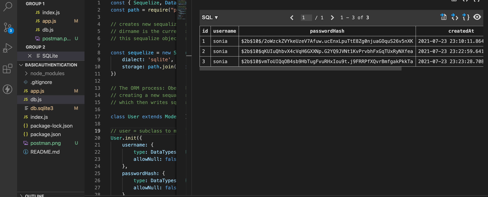
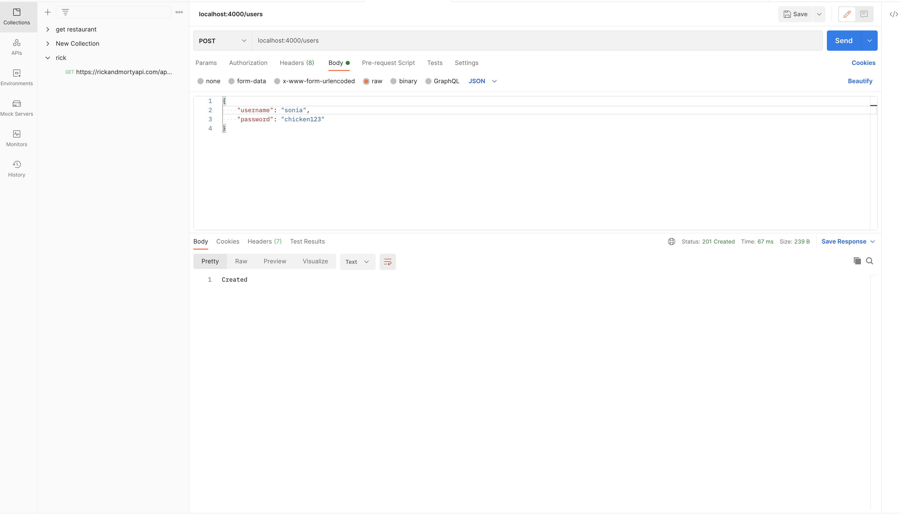

# BasicAuthentication
https://multiverselearningproducts.github.io/swe/mod1/wk1/day5.html#javascript 

# Tech
- Bcrypt
- Sequelize 
- Sqlite3
- node 
- express 
- Postman

Documents: 

##### app.js

##### index.js

##### db.js

#### Testing endpoints and crud on postman

